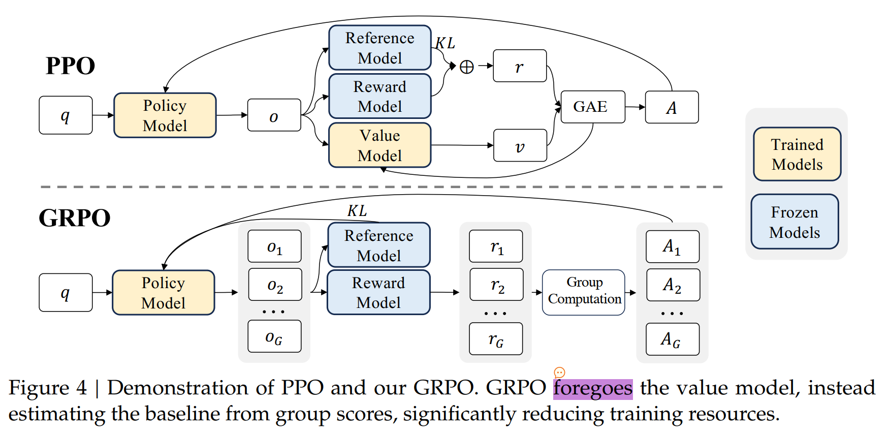
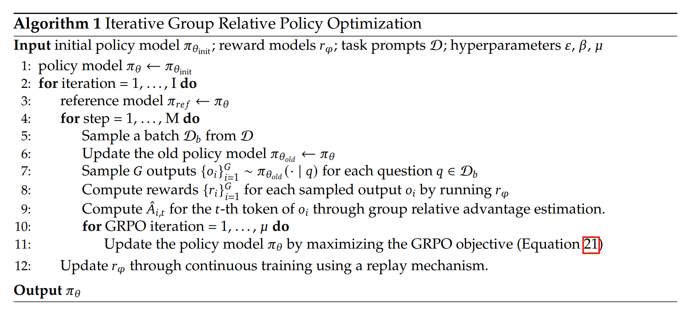

GRPO是在 DeepSeekMath: https://arxiv.org/abs/2402.03300 论文中提出的

---

> https://zhuanlan.zhihu.com/p/3333839684

# PPO
 GRPO【组相对策略优化, Group Relative Policy Optimization】是从 PPO【近端策略优化，Proximal Policy Optimization】优化而来的，因此需要先学习GRPO。

PPO是actor-critic的RL算法，在LLM中，常常优化以下的代理目标：
> 该公式来自DeepSeekMath的公式（1）

$$
\begin{equation}
\mathcal{J}_{PPO}(\theta) = \mathbb{E}[q \sim P(Q), o \sim \pi_{\theta old}(o|q)] \frac{1}{|o|} \sum_{t=1}^{|o|} min [ \frac{\pi_{\theta} (o_{t} | q, o_{<t})}{\pi _{\theta old}(o_{t} | q, o_{<t})} A_{t}, clip( \frac{\pi _{\theta} (o_{t} | q, o_{<t})}{\pi _ {\theta old}(o_{t} | q, o_{<t})}, 1 - \epsilon, 1 + \epsilon) A_{t}]  
\end{equation}
$$

公式1中的 $\pi \theta$，是可以单独拿出来的，即
$$
\begin{equation}
\mathcal{h}(o_{t}) = \frac{\pi _{\theta} (o_{t} | q, o_{<t})}{\pi _ {\theta old}(o_{t} | q, o_{<t})}
\end{equation}
$$

那么公式1中就可以重写成：
公式1中的 $\pi \theta$，是可以单独拿出来的，即
$$
\begin{equation}
\mathcal{J}_{PPO}(\theta) = \mathbb{E}[q \sim P(Q), o \sim \pi _{\theta old}(o|q)] \frac{1}{|o|} \sum_{t=1}^{|o|} min [ \mathcal{h}(o_{t}) A_{t}, clip( \mathcal{h}(o_{t}), 1 - \epsilon, 1 + \epsilon) A_{t}]  
\end{equation}
$$

进一步可以写成:
$$
\begin{equation}
\mathcal{J}_{PPO}(\theta) = \mathbb{E}[q \sim P(Q), o \sim \pi _ {\theta old}(o|q)] \frac{1}{|o|} \sum_{t=1}^{|o|} min [ \mathcal{h}(o_{t}) , clip( \mathcal{h}(o_{t}), 1 - \epsilon, 1 + \epsilon)] A_{t}  
\end{equation}
$$

这样就可以清晰的看到了，对于 $ \mathcal{h}(o_{t}) $，需要和它的裁剪之后的值，再取最小值，然后乘以 优势 $A_{t}$ ，得到 $t$ 时刻的目标

> $\pi_{\theta}$ 和 $\pi_{\theta old}$ 分别是当前的policy model和 old policy model

> $q$ 和 $o$ 是从question dataset $P(Q)$ 和 old policy model $\pi_{\theta old}$ 中采样得到的questions 和 outputs

> $\epsilon$ 是PPO中为了训练的稳定性引入的超参数

> $A_{t}$ 是优势， 是基于 $rewards\{r_{\geq t}\}$ 和 学习到的价值函数 $V_{\psi}$，通过GAE( Generalized Advantage Estimation)计算得到的

因此在PPO，不仅需要训练 policy model，同时还要学习价值函数（value function), 价值函数通常也叫做 value model，一般是和 policy model 同样结构的网络。

为了缓解reward model的过度优化，标准做法是在每个token的奖励中添加来自参考模型的逐token KL惩罚，即

$$
\begin{equation}
r_{t} = r_{\psi}(q, o_{\leq t}) - \beta \log \frac{\pi_{\theta} (o_{t} | q, {o_{t}})} {\pi_{ref}(o_{t} | q, o_{t})}
\end{equation}
$$

> 其中 $r_{\psi}$ 是奖励模型， $\pi_{ref}$是参考模型（参考模型一般使用SFT model作为初始化），$\beta$ 是KL 惩罚的系数

 **TODO:  $r_{t}$ 和 $A_{t}$ 是怎么计算的** 

## GPRO
由于PPO中使用的价值函数通常与策略模型大小相当，它带来了相当大的内存和计算负担。此外，在强化学习训练过程中，价值函数被视为计算优势的baseline，以减少方差。而在大型语言模型的背景下，通常只有最后一个标记会被奖励模型分配一个奖励分数，这可能会使得在每个标记上都准确的价值函数的训练变得复杂。

因此我们提出不需要额外的价值函数/网络的GRPO，使用对于同一个question产生的多个采样输出的的平均奖励作为baseline。更具体地，对于每个问题 $q$，GRPO 从 old policy $\pi_{\theta old}$ 中采样一组输出 $\{o_{1}, o_{2}, ... , o_{G}\}$，然后优化以下的目标：

$$
\begin{equation}
\mathcal{J}_{GRPO}(\theta) = \mathbb{E}[q \sim P(Q), \{o_{i=1}^{G}\} \sim \pi_{\theta old}(o|q)] \frac{1}{G} \sum_{i=1}^{G} \frac{1}{|o_{i}|} \sum_{t=1}^{|o_{i}|} \{ min [ \frac{\pi _{\theta}(o_{i,t}|q, o_{i<t})}{\pi _{\theta old}(o_{i,t}|q, o_{i<t})} \hat{A}_{i,t}, clip( \frac{\pi _{\theta}(o_{i,t}|q, o_{i<t})}{\pi _{\theta old}(o_{i,t}|q, o_{i<t})}, 1-\epsilon, 1+\epsilon) \hat{A}_{i,t} ] - \beta \mathbb{D}_{KL}[\pi_{\theta} || \pi_{ref}] \} 
\end{equation}
$$

> $\epsilon$ 和 $\beta$ 超参数

> $\hat{A}_{i,t}$ 基于每个group内部的输出计算的相对奖励计算的优势，

GRPO 计算优势的 组相对方法，与奖励模型的比较性质非常契合，因为奖励模型通常是在同一个问题输出之间进行比较的数据集上进行训练的。

相比于 PPO在奖励中增加 KL惩罚，GRPO 直接将 trained policy 和 ref policy 之间KL散度添加到损失中进行正则化， 從而避免了复杂化$\hat{A}_{i,t} $的计算。

和公式(5)中使用的KL惩罚项不同的是，GRPO使用无偏估计器估计KL散度， 保证永远为正，如下所示：

$$
\begin{equation}
\mathbb{D}[\pi_{\theta} || \pi _{ref}] = \frac{ \pi _{ref}(o_{i, t}|q, o_{i, <t})}{\pi _{\theta}(o_{i, t}|q, o_{i, <t})} - \log \frac{ \pi _{ref}(o_{i, t}|q, o_{i, <t})}{\pi _{\theta}(o_{i, t}|q, o_{i, <t})} - 1
\end{equation}
$$

## 算法流程图

随着强化学习训练过程的推进，旧的reward model可能不足以监督当前的policy model, 因此本文探索了使用GRPO的迭代地强化学习。如算法1所示，在迭代GRPO中，我们基于policy model的采样结果生成新的reward model训练集，并且持续训练旧的reward model使用混合了10%历史数据的重放机制。然后我们将ref model设置为policy model, 继续使用new reward model 训练policy model。

## 结果监督的RL with GRPO

对于每个问题q，从 old policy model $\pi_{\theta old}$  采样的一组输出 $\{o_{1}, o_{2}, ... , o_{G}\}$。然后使用reward model 对输出进行打分，对应地产生 $G$ 个 rewards $r = \{r_{1}, r_{2}, ..., r_{G}\}$。接着这些rewards减去组均值，除以组方差进行归一化。结果监督在每个输出的end提供归一化奖励，设置输出的所有token的优势$ \hat{A}_{i,t} $ 为归一化奖励，即

$$ \hat{A}_{i,t} = \tilde{r}_{i} = \frac{r_i - mean(\mathbf{r})}{std(\mathbf{r})} $$

## 过程监督的RL with GRPO

结果监督只在每个输出的结束位置提供奖励，这对于复杂的数学任务可能无法提供足够的监督策略。所以本文探索了在每个推理步骤的结束位置提供奖励的过程监督。正式而言，给定问题q和采样得到的G个输出$\{o_{1}, o_{2}, ... , o_{G}\}$，过程奖励模型对每一个步的输出进行打分，产生对应的奖励：


$$ \mathbf{R} = \Big\{ \Big\{ r_{1}^{\text{index}(1)}, \ldots, r_{1}^{\text{index}(K_{1})} \Big\}, \ldots, \Big\{ r_{G}^{\text{index}(1)}, \ldots, r_{G}^{\text{index}(K_{G})} \Big\} \Big\} $$


其中，$index(j)$ 是 $j$-th step的end token的index, $K_i$ 是 $i$-th输出的 steps的总数。这些奖励也使用均值和方差进行归一化，即 
$$ \tilde{r}_{i}^{index(j)} = \frac{r_{i}^{index(j)} - mean(\mathbf{R})}{std(\mathbf{R})}$$ 
接下来过程监督计算每个token的优势为归一化的奖励的总和，即 $\hat{A}_{i,t} = \sum_{index(j) \geq t} \tilde{r}_{i}^{index(j)}$。然后通过最大化公式3中的策略。

