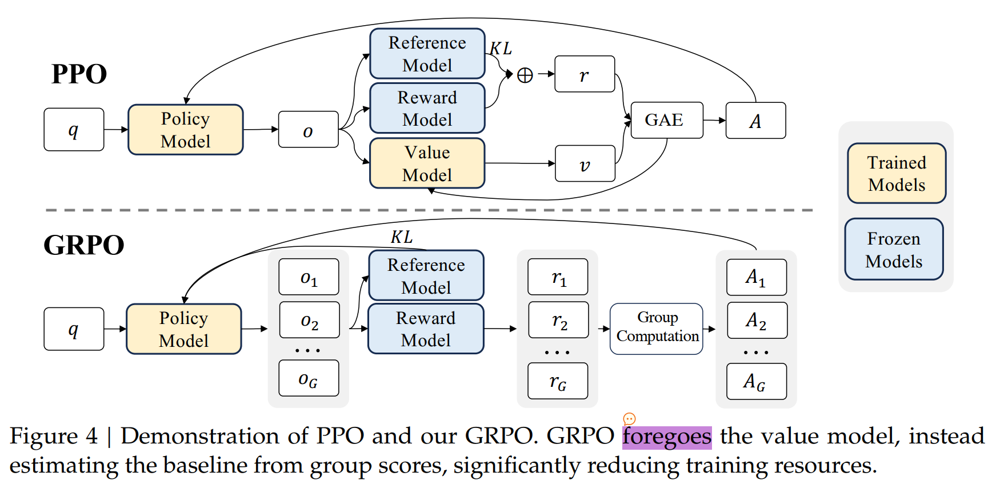

---
**Ref:**

> <https://zhuanlan.zhihu.com/p/3333839684>

> <https://zhuanlan.zhihu.com/p/22978147852>

# PPO
 GRPO【组相对策略优化, Group Relative Policy Optimization】是从 PPO【近端策略优化，Proximal Policy Optimization】优化而来的，因此需要先学习PPO。

## 总体结构

PPO是actor-critic的RL算法，在LLM中，常常优化以下的代理目标：

> 该公式来自DeepSeekMath的公式（1）

$$
\begin{equation}
\mathcal{J}_{PPO}(\theta) = \mathbb{E}[q \sim P(Q), o \sim \pi_{\theta old}(o|q)] \frac{1}{|o|} \sum_{t=1}^{|o|} min [ \frac{\pi_{\theta} (o_{t} | q, o_{<t})}{\pi _{\theta old}(o_{t} | q, o_{<t})} A_{t}, clip( \frac{\pi _{\theta} (o_{t} | q, o_{<t})}{\pi _ {\theta old}(o_{t} | q, o_{<t})}, 1 - \epsilon, 1 + \epsilon) A_{t}]  
\end{equation}
$$

公式1中的 $\frac{\pi_{\theta}}{\pi_{\theta old}}$ 项重复出现，可以写成

$$
\begin{equation}
\mathcal{h}(o_{t}) = \frac{\pi _{\theta} (o_{t} | q, o_{<t})}{\pi _ {\theta old}(o_{t} | q, o_{<t})}
\end{equation}
$$

那么公式1中就可以重写成：
$$
\begin{equation}
\mathcal{J}_{PPO}(\theta) = \mathbb{E}[q \sim P(Q), o \sim \pi _{\theta old}(o|q)] \frac{1}{|o|} \sum_{t=1}^{|o|} min [ \mathcal{h}(o_{t}) A_{t}, clip( \mathcal{h}(o_{t}), 1 - \epsilon, 1 + \epsilon) A_{t}]  
\end{equation}
$$

进一步可以写成:
$$
\begin{equation}
\mathcal{J}_{PPO}(\theta) = \mathbb{E}[q \sim P(Q), o \sim \pi _ {\theta old}(o|q)] \frac{1}{|o|} \sum_{t=1}^{|o|} min [ \mathcal{h}(o_{t}) , clip( \mathcal{h}(o_{t}), 1 - \epsilon, 1 + \epsilon)] A_{t}  
\end{equation}
$$

这样就可以清晰的看到了，对于 $ \mathcal{h}(o_{t}) $，需要和它的裁剪之后的值，再取最小值，然后乘以优势 $A_{t}$ ，得到 $t$ 时刻的目标

> $\pi_{\theta}$ 和 $\pi_{\theta old}$ 分别是当前的policy model和 old policy model

> $q$ 和 $o$ 是从question dataset $P(Q)$ 和 old policy model $\pi_{\theta old}$ 中采样得到的questions 和 outputs

> $\epsilon$ 是PPO中为了训练的稳定性引入的超参数

> $A_{t}$ 是优势， 是基于 $rewards\{r_{\geq t}\}$ 和 学习到的价值函数 $V_{\psi}$，通过GAE( Generalized Advantage Estimation)计算得到的

因此在PPO，不仅需要训练 policy model，同时还要学习价值函数（value function), 价值函数通常也叫做 value model，一般是和 policy model 同样结构的网络。

为了缓解reward model的过度优化，标准做法是在每个token的奖励中添加来自参考模型的逐token KL惩罚，即

$$
\begin{equation}
r_{t} = r_{\psi}(q, o_{\leq t}) - \beta \log \frac{\pi_{\theta} (o_{t} | q, {o_{t}})} {\pi_{ref}(o_{t} | q, o_{t})}
\end{equation}
$$

> 其中 $r_{\psi}$ 是奖励模型， $\pi_{ref}$是参考模型（参考模型一般使用SFT model作为初始化），$\beta$ 是KL 惩罚的系数

## Reward Model

$r_{t}$ 是奖励，核心定义为：环境（或认为）对智能体【如：LLM】在时间步 $\mathcal{l}$ 采取的动作【如生成某个token、完成部分推理步骤】的反馈信号。用于衡量该动作对于完成任务的 “贡献度” ，是强化学习中引导策略优化的核心指标。

$r_{t}$如何得来？可以通过定义一种规则，即奖励函数获得，如GRPO中。或者使用Reward Model，如在PPO中。

#### 如何训练

Reward Model的训练是监督学习的过程，核心是利用 “人类标注的偏好数据“ 训练一个回归模型，使其能够对文本序列进行打分，具体步骤如下：

1. 人类偏好数据

数据形式使用三元组 （prompt, choosen_response, rejected_response) 其中choosen_response 和 rejected_response 是LLM对同一个prompt生成的2个不同的回答。需要标注这2个回答哪个更好。

**例如**

- prompt：“如何煮奶茶？”
- response1：“牛奶煮沸加茶叶，煮 5 分钟即可。”（步骤清晰）
- response2：“先倒水，再放奶。”（步骤模糊）
- 人类标注：response1 > response2（response1 更好）。

2. 网络结构

通常使用与LLM相同的架构，使用SFT阶段的权重作为初始化参数，但是输出层是回归一个标量

输入：拼接之后的 `[prompt][response]`

输出：标量奖励

**输出是否要做归一化？**

- 在RM训练中：不进行归一化操作，因为RM只需要学会排序即可。常使用weight decay或者 L2 Regularization

- 在PPO训练中：必须进行归一化操作，因为要稳定PPO的训练过程，防止梯度消失和爆炸。一般使用移动平均归一化，减均值（当前全局奖励均值，由指数移动平均EMA更新），除标准差（当前全局奖励标准差，由指数移动平均EMA更新）来实现。

3. 损失函数：最大化偏好排序的一致性

训练的目标：r(choose) > r(reject) ，即偏好的响应获得更高的奖励。

使用基于排序的二元交叉熵损失 （Binary Cross Entropy Loss for Ranking), Reward Model的损失函数用于**建模偏好概率**, 核心思想是同一个prompt, choosed_response的奖励应当显著高于rejected_response。最常使用 **Bradley-Terry 模型的变体**，具体形式为：

$$
L_{RM} = -\log(\sigma(r_{\theta}(s, y^{+}) - r_{\theta}(s, y^{-})))
$$

其中：

- $r_{\theta}(s, y)$ 表示 参数为 $\theta$ 的Reward Model对状态 $s$ （即prompt）和响应 $y$ （即 response）的奖励值

    - $s$ = prompt
    - $y^{+}$ = chosen_response
    - $y^{-}$ = rejected_response
    - $\sigma$ 是Sigmoid函数，即 $\sigma(x) = \frac{1}{1 + e^{x}}$
    - $r_{\theta}(s, y^{+}) - r_{\theta}(s, y^{-})$ 是2个响应的奖励差值
    - 目标概率 $P(y^{+} \succ y^{-}) = \sigma(r_{\theta}(s, y^{+}) - r_{\theta}(s, y^{-}))$ 表示模型预测 $y^{+}$ 优于 $y^{-}$ 的概率

**损失函数的直观解释**

- 当 $r_{\theta}(s, y^{+}) \gg r_{\theta}(s, y^{-})$ 时， $\sigma(差值) \approx 1$, 损失 $L_{RM} \approx 0$  （理想情况）
- 当 $r_{\theta}(s, y^{+}) < r_{\theta}(s, y^{-})$ 时， $\sigma(差值) \approx 0$, 损失 $L_{RM} \to \infty$  （糟糕情况）
- 等效形式
$$
L_{RM} = \log(1 + exp(-r_{\theta}(s, y^{+}) - r_\theta(s, y^{-})))
$$
这是2元交叉熵损失的标准写法，强调排序而非绝对奖励值。

**讨论：为什么使用该损失函数？**

1. 偏好建模：人类反馈通常是相对偏好（A比B好），而非绝对评分。该损失直接优化排序能力。
2. 避免奖励黑客（Reward Hacking)：仅优化差值（而非绝对奖励值）可以防止Reward Model输出人任意高的奖励值（比如，对所有的奖励都打高分）
3. Sigmoid + log 保证损失平滑，适合梯度下降优化。
4. 与PPO兼容：在PPO阶段，标量奖励 $r_{\theta}(s, y)$ 可以直接用于计算策略梯度。

## Value Model

在RLHF中，Value Model负责估计状态价值函数，为策略优化提供关键信号。与Reward Model不同，Value Model在PPO训练中持续更新，直接影响策略学习的稳定性和效率。

**区别**
 
 - Reward Model： 提供 **即时奖励 $r_{t}$** ，标量，在PPO中**冻结参数**
 - Value Model：  预测**未来累积奖励 $V(s_{t})$** ，在PPO中**持续更新**

### 状态价值函数

Value Model 估计状态价值函数

$$
V_{\pi}(s_{t}) = \mathbb{E}_{\pi}[\sum_{k=t}^{T}\gamma^{k-t}r_{k} | s_{t}]
$$

- $s_{t}$ ：时间步 $t$ 的状态 （在LLM中是 `prompt` + 已生成的部分文本）
- $\pi$ ：当前策略，即待优化的LLM
- $\gamma$ ： 折扣因子，通常设置为 0.99 ~ 1
- $r_{k}$ ：时间步 $t$ 的即时奖励，来自Reward Model。

### 优势函数

为策略更新提供方向信号（正/负）

$$
A_{t} = Q_{t} - V(s_{t}) \approx r_{t} + \gamma V(s_{t + 1}) - V(s_{t})
$$

#### GAE

GAE（Generalized Advantage estimator， 广义优势估计）是用于**估计**优势函数的核心技术，在2015年由John Schulman等人提出。它通过巧妙地的平衡**偏差（Bias）**和**方差（Variance）**，成为PPO等现代梯度策略算法的关键组件。在RLHF训练LLM时，GAE时解决**稀疏奖励**和**长序列依赖**问题的核心工具。

 - 蒙特卡洛估计（MC）

 $$
 A_{t}^{MC} = \sum_{k=t}^{T} \gamma^{k-t}r_{k} - V(s_t)
$$

    
    优点：无偏估计
    缺点：
        高方差：需要完整轨迹
        低数据效率：必须等到序列结束才能更新。
        LLM场景中：奖励信号只在结束时给出，早期的token无法学习

适用于 短序列、低噪声环境

- TD(0) 估计

$$
A_{t}^{TD} = r_t + \gamma V(S_{t+1}) - V(S_t)
$$

时间残差估计的优点是：低方差，可在线更新。缺点是：高偏差，因为仅考虑一步的回报；在LLM场景中，当 $r_t = 0$ （中间步骤🈚️奖励）时，$A_{t}^{TD} \approx \gamma V(s_{t+1}) - V(s_t)$，信号极弱。

适用于 长序列、高噪声环境

**✅ GAE的使命**：在偏差和方差间找到最优平衡点，特别适合长序列生成任务（如语言模型）。 

**GAE数学原理**

GAE基于TD(λ)框架，其核心是λ-回报（λ-return 

$$
R_{\lambda}^{t} = (1 - \lambda) \sum_{n=1}^{\infty} \lambda^{n-1}R_{t}^{(n)}
$$

其中 $R_{t}^{(n)}$ 是 **n步截断回报** :

$$
R_{t}^{(n)} = r_t + \gamma r_{t+1} + \cdot \cdot \cdot + \gamma^{n-1} r_{t+n-1} + \gamma^{n} V(s_{t+n})
$$

其中：$\lambda$ 控制历史步长的权重：

 - $\lambda = 0$ ： 仅使用1步, 即 TD(0)，$R_t^{\lambda} = R_t^{(1)} = r_t + \gamma V(s_{t+1})$
-  $\lambda = 1$ ：用无穷步，即 MC，$R_t^{\lambda} = R_t^{(\infty)} = \sum_{k=t}^{T}\gamma^{k-t}r_{k}$
- $0 < \lambda < 1$ ：加权不同步长的回报

$\lambda$ 越小，越关注短期回报，【接近 TD(0)，低方差高偏差】；$\lambda$ 越大，越关注长期回报【接近 MC，高方差低偏差）

**GAE 优势函数定义**

将 $\lambda$-回报 代入 优势函数：

$$
\delta_{t} = r_t + \gamma V(s_{t+1}) - V(s_t) \quad \quad(TD残差) \
$$

$$
A_{t}^{GAE} = \delta_{t} + (\gamma \lambda)A_{t+1}^{GAE}
$$

计算是从**后往前**进行的，即从序列末尾 $T$ 开始，反向计算到 $t = 1$

初始条件：$A_{T}^{GAE} = \delta_{T} = r_{T} - V(s_T)$，因为 $V(s_{T+1})$ 通常是0

假设生成5-token响应，Reward Model在结束时给出奖励R=0.8 ：

| 时间步 | 状态 | 原始奖励 $R_T$ | TD残差 $\Delta_T$ | GAE 优势 $A_T$ ( $\Lambda = 0.95, \Gamma = 1.0$ ） |
| --- | --- | --- | --- | --- |
| 5 | 完整响应 | 0.8 | 0.8 - $V(s_5)$ |  0.7 ，假设  $V(s_5)=0.1$） |
| 4 | 响应[:-1] | 0 |  $V(s_5) - V(s_4)$ |  $-0.2 + 0.95 \times 0.7 = \boldsymbol{0.465}$  |
| 3 | 响应[:-2] | 0 |  $V(s_4) - V(s_3)$ |  $-0.1 + 0.95 \times 0.465 = \boldsymbol{0.342}$  |
| 2 | 响应[:-3] | 0 |  $V(s_3) - V(s_2)$ |  $-0.1 + 0.95 \times 0.342 = \boldsymbol{0.225}$  |
| 1 | prompt | 0 |  $V(s_2) - V(s_1)$ |  $-0.1 + 0.95 \times 0.225 = \boldsymbol{0.114}$  |

**✅ 关键观察：**

- 即使中间步骤$r_t = 0$，GAE仍能将最终奖励回传到早期token
- 优势值随生成步骤指数衰减（由λ 控制）
- 早期token获得正向信号（Aₜ>0），鼓励生成类似完整响应

### 模型结构

和Policy模型架构相同，添加一个MLP Head，使其能够输出标量值。在实际训练中，可以和Policy Model共享Transformer层，只更新MLP Head。这样设计有如下优势：

1. 策略与价值估计的空间一致，避免“价值-策略失配“ 问题。
2. 训练效率高（更新的参数少，节省显存）

输入：拼接 `[prompt][response]`，中间添加特殊分隔符。这样可以精确表示当前状态 $s_{t}$ ，区分 prompt 和 response 部分。

MLP Head中不能使用 *ReLU* 激活函数，推荐使用 **GeLU/SiLU**，保持输出范围是 $(-\infty, +\infty)$，适应奖励分布变化。

### 如何训练

Value Model的训练数据来自 **PPO采样阶段**

1. 用当前Policy Model $\pi_{old}$ 生成一批轨迹

$$
\tau = (s_1, a_1, r_1, s_2, a_2, r_2, ... , s_T, a_T, r_T)
$$

- $s_t$ 表示 `prompt` + 已经生成的前 $t - 1$ 个 token
- $a_t$ 表示 第 $t$ 个生成的 token
- $r_t$ 表示 Reward Model的输出，（通常 $r_t = 0$ for $t < T$, $r_T = R$ ）

2. 计算修正奖励

$$
r_{t}^{final} = r_{t}^{RM} - \beta \cdot KL (\pi_{\theta} || \pi_{old} )
$$

3. 使用 修正奖励 $r_{t}^{final}$ 计算 GAE 优势 $A_{t}^{GAE}$

4. 计算MSE损失

$$
L^V = \frac{1}{T}\sum_{t=1}^{T}(V_{\phi}(s_t) - R_t)^2
$$

- $\phi$ 表示 Value Model 的参数

**这里很乱，需要看原始论文**
